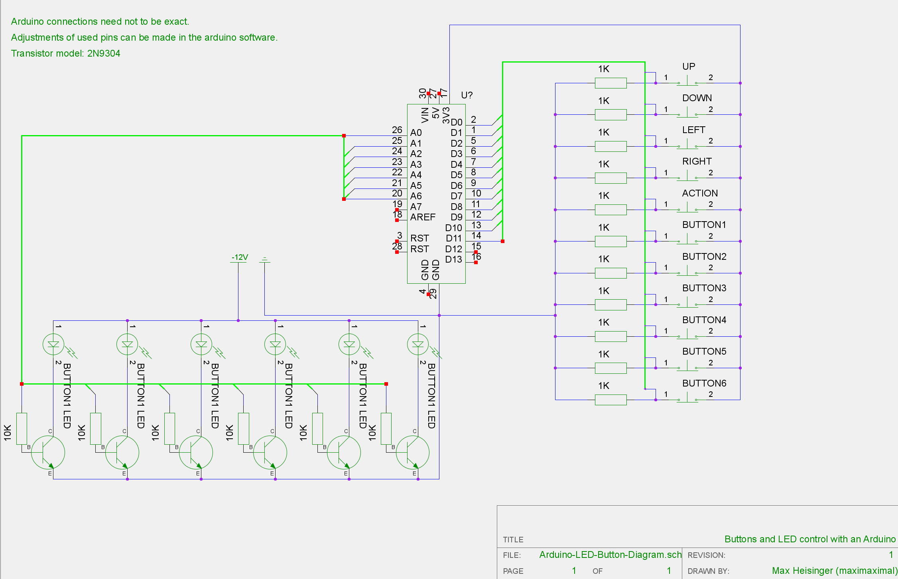

Arduino Onboard Host
====================

This host uses an arduino to get signals from the buttons and joysticks and to 
set the output levels of 6 LEDs per player. The host can control multiple 
Arduinos, each one handling one player with 6 buttons, one joystick (up, down, left, right, 1 button),
and one LED in each button. 

In the standard configuration, up to 16 simultanous players can be handled by this host. This can be
adjusted in the code though. 

Wiring of the Arduino, Buttons, and LEDs
----------------------------------------

The wiring can be taken out of this diagram: 

[dark version](Arduino-LED-Button-Diagram-Dark.png) | [bright version](Arduino-LED-Button-Diagram-Bright.png) | [source schematic](Arduino-LED-Button-Diagram.sch)

